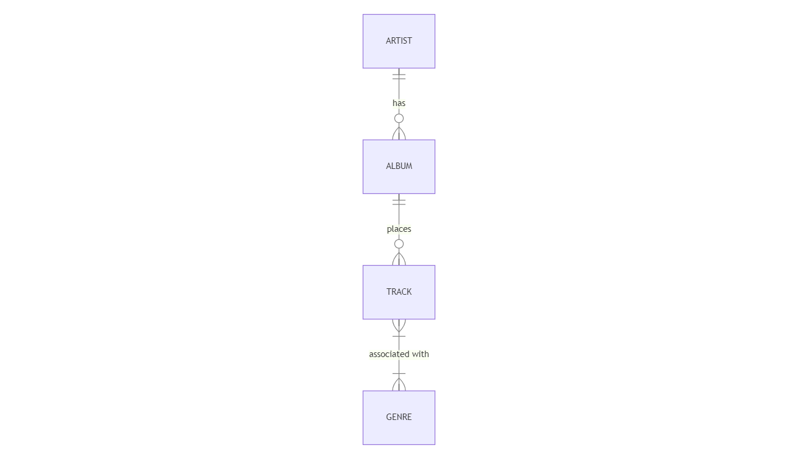

# Music Library Database Design Document

By EG Kassandra B. del Rosario

**Video Overview:** https://youtu.be/QnJDK3i47pg

## Scope

The Music Library Database aims to facilitate the management and organization of music tracks, artists, albums, and genres.

The scope includes:

- *Artists: Storing information about music artists, including their names and details
- *Albums: Managing music albums, including album names, release dates, and artists
- *Tracks: Storing information about individual music tracks, such as track name, duration, and genre
- *Genres: Managing music genres and associating tracks with specific genres

Out of scope are advanced features like user playlists, social interactions, or streaming capabilities.

## Functional Requirements

The Music Library Database will support the following functions:

- **CRUD Operations: Users can Create, Read, Update, and Delete records for artists, albums, tracks, and genres.
- **Search and Filter: Users can search for tracks, albums, and artists based on various criteria like artist name, album name, or genre.
- **Track Listings: Users can view details about tracks within an album.
- **Genre Association: Tracks can be associated with specific genres to enable genre-based filtering.

## Representation

Entities are represented as SQLite tables with the following schema:

### Entities

The database includes the following entities:

#### Artists

The ARTIST entity is represented by the artists table, which contains the following attributes:

- `id` (INTEGER, PRIMARY KEY) : A unique identifier for each artist
- `first_name` (TEXT): The first name of the artist.
- `last_name` (TEXT): The last name of the artist.
- `bio` (TEXT): A text field to store a biography or additional information about the artist.

#### Albums

The ALBUM entity is represented by the albums table and includes the following attributes:

- `id` (INTEGER, PRIMARY KEY): A unique identifier for each album.
- `title` (TEXT): The title or name of the album.
- `release_date` (DATE): The date when the album was released.
- `artist_id` (INTEGER, FOREIGN KEY references `artists.id`): A reference to the corresponding artist who created the album.
- `genre_id` (INTEGER, FOREIGN KEY references `genres.id`): A reference to the genre associated with the album.

#### Tracks

The TRACK entity is represented by the tracks table and consists of the following attributes:

- `id` (INTEGER, PRIMARY KEY): A unique identifier for each track.
- `title` (TEXT): The title or name of the track.
- `duration` (REAL): The duration or length of the track.
- `album_id` (INTEGER, FOREIGN KEY references `albums.id`): A reference to the album to which the track belongs.

#### Genres

The GENRE entity is represented by the genres table and includes the following attributes:

- `id` (INTEGER, PRIMARY KEY): A unique identifier for each genre.
- `name` (TEXT): The name or label of the genre.

### Relationships

The following Entity Relationship Diagram (ERD) illustrates the relationships among entities in the database:

As detailed by the diagram:

- An artist can produce multiple albums, but each album is associated with one artist.
- Each album contains multiple tracks, and each track belongs to a specific album.
- Tracks can be associated with one or more genres, and each genre may have multiple associated tracks.

## Optimizations

To optimize query performance, the following indexes are created:

- Index on `artists` table for the `first_name` and `last_name` fields for faster artist lookups.
- Index on the `albums` table for the `title` field for quicker album identification.
- Index on the `genres` table for the `name` field to speed up genre-based searches.

## Limitations

- The database does not support advanced features like user authentication, playlists, or social interactions.
- Collaborative artist entries (multiple artists for a track) are not supported in the initial schema.

This design document serves as a foundation for creating the Music Library Database, allowing for efficient music management and organization. For more advanced features, additional tables and functionality can be added in future iterations.
